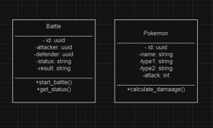

# Pokémon Battle Simulator

## Overview

The Pokémon Battle Simulator allows you to simulate battles between Pokémon and calculate damage based on their attack stats and types. This application provides a REST API to interact with the battle simulation.

## Project Structure

- `pokemon_battle/` - Main Django project directory.
- `pokemonbattle/` - Django app containing the battle logic.
- `requirements.txt` - Project dependencies.
- `README.md` - This file.

## UML Class Diagram

The UML class diagram for the Pokémon Battle Simulator project is included as `uml_diagram.png`. This diagram illustrates the key classes and their relationships within the application.

 

## setup python environment
python -m venv venv
source venv/bin/activate  # On Windows: venv\Scripts\activate

## install requirements
pip install -r requirements.txt

## setup django database 
python manage.py migrate

## run the application
python manage.py runserver

## run all the unit tests
python manage.py test

## Setup

### 1. Clone the Repository

git clone https://github.com/vikashagrawal901/pokemon_battle.git

